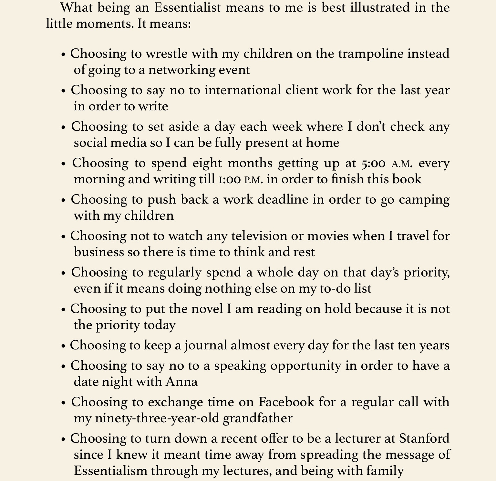

## Essentialism by Greg McKeown

### Summary:

This book lays out a philosophy for life focused on doing less things, and how that can lead to a better life. 

### Who is an essentialist?

- THe way of the Essentialist is the relentless disciplined pursuit of less but better. It doesn't mean occasionally following it, instead it means pursuing it in a disciplined way. It is about constantly introspecting, "am I investing in the right activities?". The answer is "no" by default.
- Weak criteria for evaluation: "can I fulfill this request, given the time and resources I have?". Strong criteria: "Is this the very most important thing I should be doing with my time nad resources right now?"
- Saying "yes" to please backfires. The people who you say yes to will respect you less!
- If you don't prioritize your life, someones else will / some other forces will. Top regret before dying: "I wish I have the courage to live true to myself, not what others expected of me"

- Successful people tend to have more pressure. Because everyone wants your time. Success can distract us from focusing on the essential things that produce success in the first plcae.
- Survey: most companies fail because of the "undisciplined pursuit of more"

- Why is non-essentialism the default? (i) too many options (study: more choices we have, lower the quality of our decisions), (ii) social pressure in the hyperconnected world (people expect you to respond to messages quick), (iii) the idea that you can have it all. 

- This doesn't mean an haphazard "no", but a purposeful, deliberate and strategic elimination of the time wasters and some good opportunities as well.

- Closet is a good analogy to make this point. When you don't make a concious effort to keep it organized, it's a mess. You often end up with lots of clothes you'd never wear; you could accidentally give away clotehs you wear. Solution: have an active system of purging them. 

- Essentialist vs closet: 
	- Explore / Evaluate: Don't ask "is there a chance I might wear this?". Ask "Do I love this? Do I look great in this? Do I wear this often?"
	- Eliminate: Divide clothes into "must keep" and "probably should get rid of". To avoid sunk cost fallacy, ask "if I didn't already own this, how much would I spend to buy this?"
	- Execute: Have a regular routine for doing this. Have a big bag with clothes to give away; find where you can give and schedule a time to do this. 
	- It's important to have a system that makes things as effortless as possible. 

- Real life has active threats to your essentialist principles unlike a closet. This can't be a process you undertake once a week, you should apply this each time you're faced with a decision: say yes or politely decline.

- Essentialists use hte extra time to deliberately consider more options before deciding what to pursue. 

- Explore: Qs to find which option to pursue: (i) what deeply inspires me? (ii) what am I talented at? (iii) what does the world need?
- Elimiate: Involves saying no often; pushing against social expectations. Takes courage. 
- Executing: invest in creating systems that remove obstacles and make execution as easy as possible.

- Why? More contribution, more freedom, more satisfaction.

- Society needs a change in mindset: essentialists need to be celebrated. Instead of a person with busy schedule, celebrate person who has the courage to live true to his values.

- Reflect on how short life really is and what we want to accomplish in the little time we have left. 

- Self talk to be wary of "I have to", "this is also importnat", "I can do both". Self talk should be more of "I choose to", "only a few things matter", "I can do anything but not everything"

### Chapter 2: Choose

- The Essentialist is more aware of the choices he could make. It's less vulnerable to being in autopilot as he's taking the wrong path. 

### Chapter 3: Discern

- Our default when we fail is to work harder. But we have to focus more on efficiency. Eg. Warren Buffett: 90% of his income comes from just 10 investments (he invests in few). Good software developers don't spend extra time, but they get 10,000x more done.
- E spends extra time exploring options. This time is justified because some things are so valuable thhat they repay you 10x. 
- Rate all opportunities you get on a scale. Only pick opportunities that rate more than 8/10. You get better at telling the difference between what's important and what's not with practice. 

### Chapter 4: trade-off

- Only make choices that contribute to the end goal significantly. E.g. when building a product, it's easy to fall into the trap of building unimportant features. Spend time exploring all features the product can have, but focus only on doing a few things very well.

- Non essentialists always try to squeeze more in. Promise you'll do something by Friday even though you have a deadline on the same day. 

- Companies mission statements shouldn't be vague generalities "we value apssion, execution, innovation and leadership". They should show what they actually value "Customers are first; shareholders are last".

- You have a choice between spending time with your kids or writing a book. You can't do both. Kids are a big consideration for the essentialist, this choice limits you from picking side projects you're passionate about (if you want to be close to your kids)

- Don't decry tradeoffs, embrace them. Frame tradeoff positively. Instead of "What should I give up on?", think "what can I go big on?"

### Part 2: Explore

- NE gets excited too quickly and says yes. E is more careful, think about other options, before (liekly) saying no. 

### Chapter 5: Escape

- Scheduling time away from any distractions is critical. Time to just think helps.

- Case studies:
	- Newton spend two years in isolation for writing his magnum opus: Principia Mathematica.  
	- Author: went to a motel with no internet access for 8 weeks to complete the project
	- Greg: 5am to 1pm blocked, 5 days a week to write this book
	- Jeff Weiner (LinkedIn CEO): schedules two hours of blank space to think. Having converstaions all the time is tiring)
	- Bill Gates: takes week off, twice an year to spend time reading.

Chapter 6:
- Listen carefully and pay attention to the important details. Filter out the noise.
- Good listening technique: just listen to people and ask questions about the things that pique your interest. 

Chapter 7:
- Play is key when you're doing something. Spending time playing around with concepts you learn. 
- Playing is exploring fun possiblities related to the things you learnt. Play is carefree (no deadline) exploration. 
- Play helps us have a happy life. And that's all that matters.
- Make jokes, have fun, pull people's legs. Life's too short to be taken seriously. Surprise people, prank people. 
- What activities in the past did you enjoy most? How can you incorporate that fun into your present routines?

Chapter 8:
- Don't compromise of sleep. It's the key to health. It's the key to creativity which enables highest levels of contribution. Take naps during the day to maintain performance.

Chapter 9:
- Say hell yes! Or no.
- Say yes only to top 10% opportunities. Ask "is this exactly what I'm looking for?"

Chapter 10:
- Clarity is key. Focus on doing the work, not flattering your boss. Live with intent.

Cahpter 11:
- Say no deliberately. Focus on important things. If you're with your family, and others ask you for something, say no.
- People are effective because they say no. Peter Drucker.
- Seperate the decision from the relationship. Say no gracefully allowing the other person to save face. 
- Saying no requires trading popularity for respect.
- Clear no is more graceful than a noncommittal yes.
- Strategies to say no:
	- Pause: Pause for 3 seconds before you speak. Even if it's a clear yes.
	- Soft no: no, but I'm happy to do this at a later time after I finish my book.
	- Calendar check: let me check my cal and get back to you
	- "Yes, what should I deprioritize?"
	- Humor: build reputation for saying no, so people find your no funny.
	- I can't drive you but I can give you my car.

Chapter 12
- Avoid sunk cost fallacy: "If I already didn't invest into this, how much time would I spend doing this?"
- Don't commit to things the status quo commits to. Be proud of your uniqueness. 
- Stop making casual commitments. 

Chapter 13:
- To make something better, you need to remove things. Not add. (movie, image, notes)

Chapter 14:
- Set clear boundaries from everyone except the few who you're close with. This is the only way to save time. 
- Don't spend time helping strangers unless they really work to get your attention. If they ask you something that they could have googled instead, do not respond. Respond only if you're the best person to answer their questions.
- Say no if people ask you for feedback on their drafts that they haven't worked hard on. They're making you do their work.

Chapter 15
- Plan for worst case scenarios by having buffers. It helps alleviate stress. Imagine who less stressed you would be waiting in a traffic signal if you start 5 minutes early. 
- Understand that unexpecting things will inevitably come up. Be open to changing your strategies based on that. 
- Prepare more extremely. Eg. even before university classes start, go through last years notes and understand as much as possible about the subject.

Chapter 16
- remove things that are slowing you down in your life / work. deprioritize everything that is not pushing you directly and efficiently in the direction of your goals. 
- why are your projects slow? eg. not having info you need, feeling low in energy, desire for perfection, etc., Remove these obstacles and make a shitty first draft and work from there. 
- smart way to make your team more efficient, ask them: "what obstacles are holding you back on task X and how can I help remove them?"

Chapter 17
- everyday do something that gets you closer to your goals. don't do pointless things. 
- don't go for the big flashy wins. go for the small essential wins and celebrate them. (don't chase big goals directly)
- progress is a key motivation to keep things meaningful. do small good things repeatedly and enjoy them.
- focus on minimum viable progress. what is the smallest amount of progress that will be useful for the task at hand? 
- do minimum viable prep. pick a goal / deadline and ask "what is the minimal amount I could do right now to prepare?" (spend just 1 pomodoro doing it early and come back to it later)
- visually reward progress. (example: project Neon)

Chapter 18
- repeatly visualize your routines for game day so that you can tap into that habit dorectly. 
- make routines so that acheiving would goal would become effortless if you follow these routines. make the essential the default position.
- habit: cue + routine + reward. to change routine, focus on the cue and associate the cue wit a different routine. or create new cue / triggers. 
- create a habit for deep work first thing in the morning, something that you don't ever compromise on. 
- focus on doing first thing in the morning. you can make your days into themes to have variety to your routine. (meetings day, no internet day, coding day, reading day, etc.,) start with one small routine.

Chapter 19
- focus on the best action in the moment. use the memories from the past or anticipation of the future only as long as it affects your present
- focus on just that one thing.

Chapter 20
- act as if you're a essentialist, that needs to be your deafult. don't try to add essentialism to your life. 
- own only things that are essential, simplify life. 
- essentiaism is more meaningful. doing few big things that you care about > many small things.
- family is the most important thing. give up opportunities to spend more time with family. life's too short to do unnecessary things. 
- ask what is essential, focus on it and ignore everything else.

Appendix:
- when leading a team, clarity and the focus on the most essential thing becomes incredibly important. clarity = success. pursuing too many things is a key to failure. be clear on who's responsible for what. be clear on what each member is expected to contribute.

### Questions to ask yourself:

- Am I investing in the right activiites?
- What's my number one priority?
- "Tell me, what is it you plan to do with your one short, wild and precious life?" Mary Oliver

### Case studies

- Sam Elliot
	- Got a new job and started saying yes to many things; stress qent up, quality of work went down. His mentor advised him to focus on the essentials and say no to everything else. 
	- He started refusing requests; colleagues were initally disappointed but started respecting him more over time. He didn't jump on email threads. He didn't attend meeting unless he had a direct contribution ot make. 
	- Spent the new found time to focus on one project at a time: planning throughly, working deeply and anticipating / removing obstacles. Quality of work went up. Got the largest bonus of his life.
	- Doesn't work after going home. Shuts off the phone, eats with his wife and goes to the gym. 

- Dieter Rams
	- Almost everything is noise. Only few things are essential. 

Quotes to think about:
- "The Wisdom of life consists in the elimination of non-essentials."